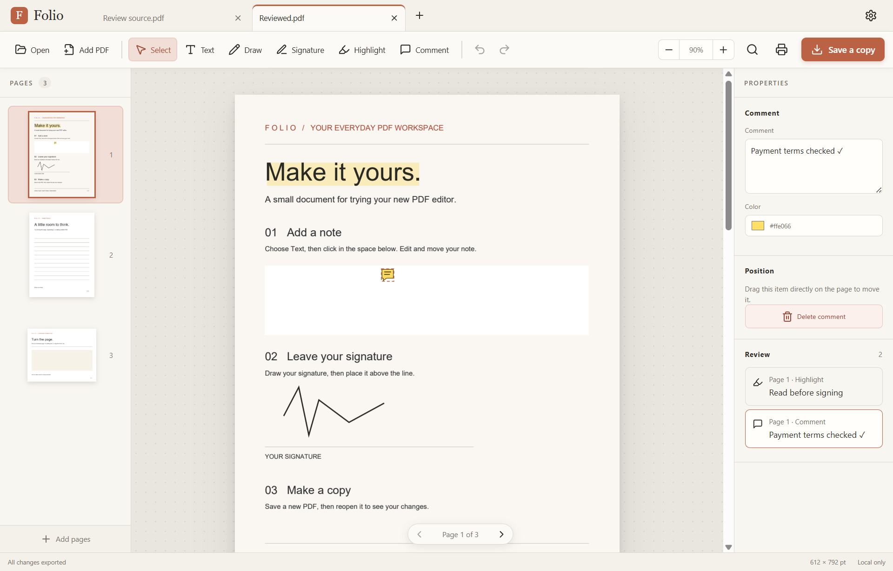

# Folio

Your everyday PDF workspace. A local Windows desktop PDF editor built with Rust,
Tauri and native PDFium. No AI, account, cloud upload or subscription.



## Get Folio

Download the Windows portable ZIP from [Releases](https://github.com/willherr72/folio/releases).
Extract it and open **Folio.exe**. Keep the resources folder beside the executable.
Microsoft Edge WebView2 Runtime is required.

In this development checkout, double-click **Launch Folio.cmd** after building.
Version 0.2.0 lives in **artifacts/Folio-v0.2.0/Folio.exe**.
The ZIP is **artifacts/Folio-v0.2.0-windows-x64.zip**.

## Everyday editing

- **Text:** click a page, enter your note, adjust size/color, and drag to move it.
- **Draw:** write or sketch directly on any page. Choose pen color and width in
  Properties. Each stroke is one undo step; Select lets you move or delete it.
- **Signature:** draw in the signature pad, then click a page to place it.
- **Pages:** drag thumbnails by their handles to reorder. A line shows the drop
  position. Page properties also provide move, rotate, duplicate and delete.
  **Add PDF** appends another document.
- **Reading:** scroll continuously between pages. Hold **Ctrl** while scrolling
  to zoom around the pointer.
- **Settings:** choose Light, Dark or System theme, continuous or single-page
  view, default zoom, pen color and pen width. Preferences are remembered.
- **Save a copy:** export a new PDF while preserving source vector content.

Start with **examples/Welcome to Folio.pdf**. Ctrl+Z/Ctrl+Shift+Z undo and redo;
Ctrl+O opens a PDF and Ctrl+S saves a copy. Unsaved changes use a centered app
confirmation when opening another document or closing Folio.

Dark mode changes the interface; PDF pages retain their original colors.

## Prototype boundaries

- Existing words in a PDF are not editable.
- Drawn signatures are visual marks, not certificate-based digital signatures.
- Exported additions become page content; reopening does not restore their editing handles.
- Added text uses Helvetica with a verified Latin character set and common punctuation.
  Unsupported characters, including CJK, emoji, nonbreaking spaces and soft hyphens,
  produce an export error instead of silently disappearing.
- Search, printing, OCR, redaction, form editing and password-protected PDFs are
  not implemented.
- Windows x64 is the tested target. Foxit performance parity has not been established.

## Build from source

Install Node.js, stable Rust with the MSVC toolchain, Visual Studio C++ Build
Tools with the Windows SDK, and Microsoft Edge WebView2 Runtime.

In PowerShell:

```powershell
npm ci
powershell -NoProfile -ExecutionPolicy Bypass -File scripts/fetch-pdfium.ps1
npm run tauri dev
```

Build a release executable and portable ZIP:

```powershell
powershell -NoProfile -ExecutionPolicy Bypass -File scripts/build-portable.ps1
```

Setup downloads a pinned PDFium binary and checks its SHA-256.
All PDF processing afterward happens locally.

## Verification

```powershell
powershell -NoProfile -ExecutionPolicy Bypass -File scripts/verify.ps1
```

Browser checks: install Playwright Chromium, start the Vite server, then run
**scripts/smoke-ui.mjs** and **scripts/smoke-upgrades.mjs** with Node.
Explicit browser demo mode uses generated pages and exports a JSON edit plan.
Real PDF editing runs in the desktop app.

The native smoke opens a real PDF through Windows dialogs, edits it, draws,
drags thumbnails, checks both close-confirmation decisions, saves and reopens.
Its launcher uses an isolated test profile. See [verification notes](docs/verification.md).

## Internals and license

React keeps an undoable edit plan. Rust owns source documents and serializes
PDFium work on a dedicated thread. Nearby pages use cached native renders.
Export copies PDF pages and adds text and vector ink.

MIT for Folio's original code. Dependencies retain their own licenses; see
[third-party notices](THIRD_PARTY_NOTICES.md). Portable releases include PDFium
licenses and collected dependency notices.

[Changelog](CHANGELOG.md)
