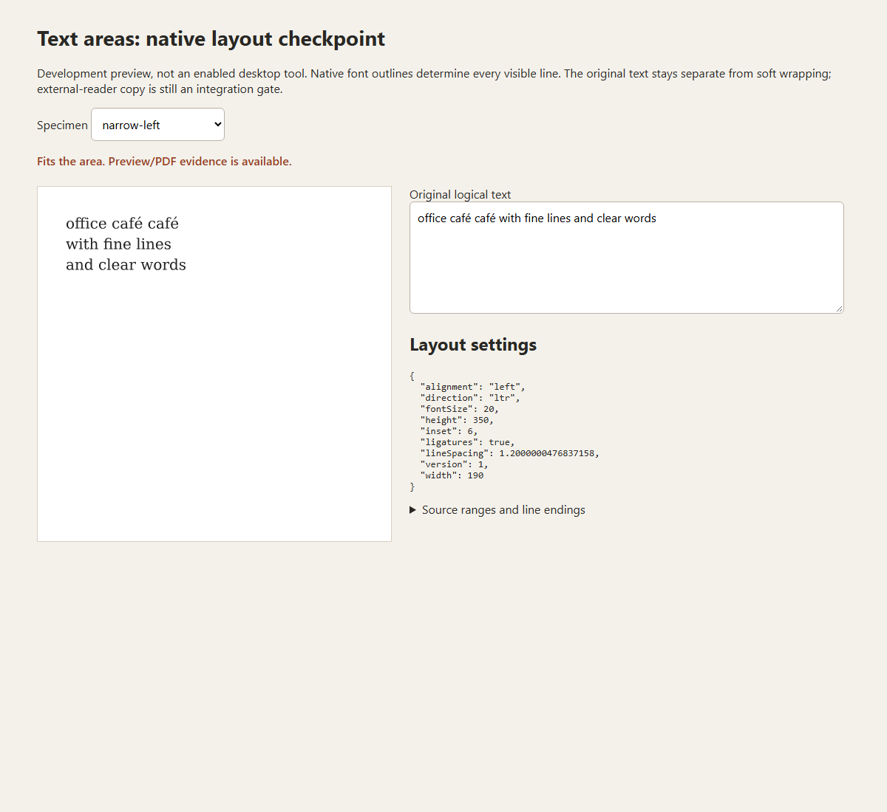

# Text-area layout checkpoint (#16)

Development work after v0.13.0, verified on Windows on 2026-09-14. This adds a
native layout API and reproducible evidence. It does **not** enable a text-area
tool in the desktop app or close #16. The downloadable release remains v0.13.0.



## What works

`layout_text_area(&FontAsset, &TextAreaRequest)` uses the exact registered font
and existing native shaping to choose lines inside an explicit area. Width,
height, inset, left/center/right alignment, line spacing, font size and ligatures
are explicit settings. Baselines use font ascent/descent and actual glyph ink.
Each selected line is shaped as its own final string; the browser does not choose
line breaks or measure approximate font widths.

Every line retains its UTF-8/UTF-16 source range and delimiter range. Concatenating
those spans reproduces the original text exactly, including repeated spaces,
CRLF/LF hard breaks, blank lines and a final empty row. Soft wraps insert no
characters into this logical model. Trailing ASCII spaces belong to the delimiter;
they are retained but not painted at a wrap/end. Glyph ranges are line-local,
with the source range identifying their position in the original string.

Long unbreakable words and NBSP-connected words remain atomic. Horizontal and
vertical overflow are explicit; the layout retains all lines within its work
budget. It never shrinks the font or silently clips/truncates text. The example
refuses to generate PDFs for overflowing layouts. `canExport` means the native
layout fits for this development fixture; it is **not** a production reader
compatibility approval.

## Supported subset and limits

This first API requires explicit LTR and Latin/Common/Inherited script content.
It wraps only at ASCII-space grapheme runs, not a full Unicode line-breaking
algorithm. A combining mark attached to a space is not split or discarded.
Controls, bare CR, bidi controls, RTL and other scripts are refused before
splitting. Existing shaper/font refusals remain in force. A whitespace-only
non-ASCII token, including an isolated NBSP token encountered as a candidate,
can be refused even within otherwise visible text. No nominal-width fallback is
used. Extremely large advances may hit the existing shaper geometry cap and
return an error instead of an overflow layout.

- Request version 1; finite dimensions up to 14,400 points; font size 1–512 points.
- Nonnegative inset leaving a positive inner area; line spacing 1–3.
- At most 4,096 scalars, 16,384 UTF-8 bytes, 64 scalars per grapheme, 256 lines.
- Shape work is charged before every candidate: at most 65,536 cumulative input
  scalars and 512 worst-case glyph reservations. Retained glyphs are capped at
  16,384; existing per-shape outline/run/operation limits remain.
- Budget exhaustion returns an error without a partial layout. The caller retains
  its original request. No font or preview cache is added by this pure API.

## Verification

Full native regression suite: **197 passed, zero failed**, with three existing opt-in tests ignored. This includes 11 focused text-area tests. Rust formatting and the library build
with default features disabled also passed.

The nine-specimen native example emits seven valid original/resaved PDF pairs
and two explicit overflow refusals. It checks exact request serialization and
recomputed layout, independently shapes each final line, verifies prepared
preview font/text identity, and protects the blank source file. Specimens cover
narrow/wide widths, three alignments, ligatures on/off, composed/decomposed
accents, repeated spaces/NBSP, CRLF/LF blank rows and both overflow directions.

[Fourteen preview comparisons](issue16-text-area-preview-verification.json)
passed at 150% and 300% against PDFium using the unchanged rasterizer tolerances.
Maximum ink-bound difference was 1 pixel; maximum centroid difference was
0.186 pixels; unmatched ink was zero within the existing 2-pixel neighborhood.
The standalone viewer was visually inspected. It uses native paths, not browser
text, for the layout preview.

[Independent reader evidence](issue16-text-area-reader-verification.json)
uses MuPDF 1.27.1, pypdf 6.14.2 and raw PDFium from the bundled library.
All seven pairs preserve reader text, PDFium character origins and raster output
through native save/reopen. MuPDF character geometry and raster are also exact.
MuPDF's unnamed Type3 font labels contain object references that change when
PDFium imports a page. The comparator ignores **only** those exact generated
font labels; the raw-dictionary mismatch remains recorded. No character box,
origin or numeric tolerance is normalized. Twelve inspector tests reject missing
text/shapes/rows, incorrect ranges, unexpected separators and changed geometry.

## Reader gate: still failing

None of the seven exports retain the complete original logical text in all
three readers, even allowing one terminal reader newline in a separate diagnostic.
Wrapped lines copy with inserted CRLF/LF separators. Blank hard-break rows and
trailing spaces are also not recovered from visible lines alone. Six cases match
the painted line strings in all readers; in the repeated-space specimen, raw
PDFium copies `one  two` as `one two`, while MuPDF and pypdf retain both spaces. The missing space is absent from
PDFium’s per-character Unicode list as well.
These are retained failures, not a green exact-copy result. The report's
`evidenceValid` means the fixture and roundtrip checks passed; it does not mean
production text-area acceptance passed.

Before enabling the tool, the next step is a shared persisted area model and
semantic/copy strategy that retains logical separators and character geometry.
The remaining work includes area resize/rotation, font changes, accessible
Content editing/IME, selection/search across soft lines, undo/recovery, resource
ownership/cancellation, and supported international text. Existing #14 mixed-bidi
and physical IME/interactive reader gates remain separate. General reflow of
existing PDF paragraphs stays excluded.

## Reproduce

Use the same pinned dependencies and included fixture fonts as the existing
shaped-text tests. No dependency versions changed for this checkpoint.

```powershell
$env:CARGO_TARGET_DIR = 'C:/Users/WilliamHerr/Desktop/Code/Folio/src-tauri/target'
cargo test --manifest-path src-tauri/Cargo.toml --test text_area -j1
cargo run --manifest-path src-tauri/Cargo.toml --example text-area-probe -j1
python -B -X utf8 scripts/test_inspect_text_area.py
python -B -X utf8 scripts/inspect-text-area.py --expected-cases 9
node scripts/smoke-text-area-preview.mjs
```

The example refuses an existing output directory; pass a new directory as its
argument for another run. Inspector `--input` and browser `FOLIO_TEXT_AREA_INPUT`
select that directory. Generated artifacts stay under `artifacts/`; the browser
script writes a standalone `text-area-browser/index.html` for visual exploration.
